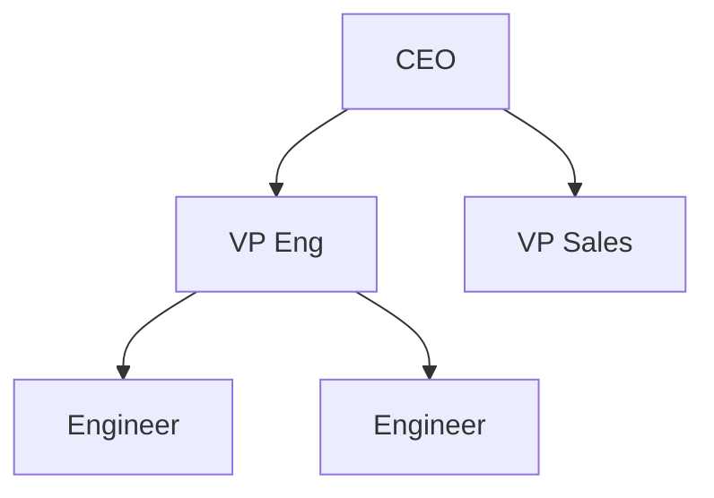
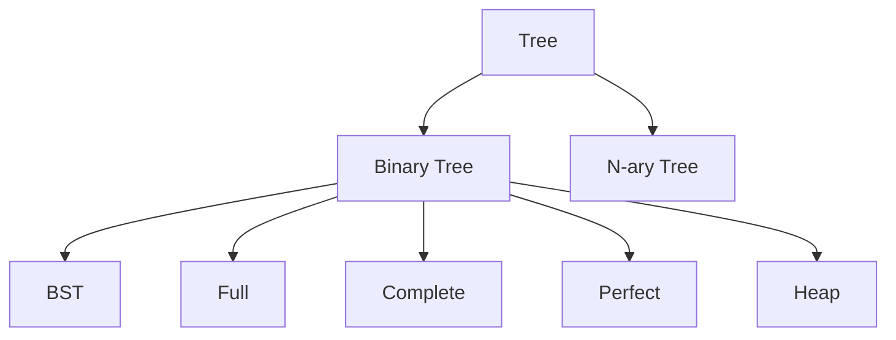
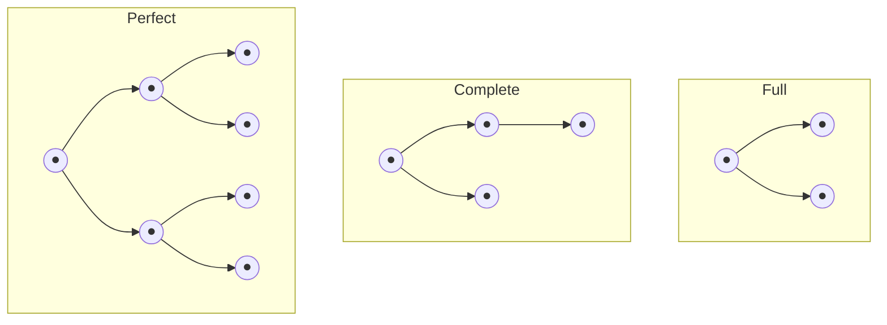
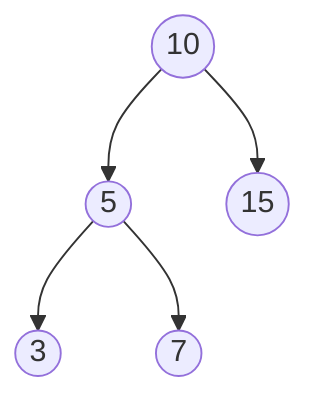
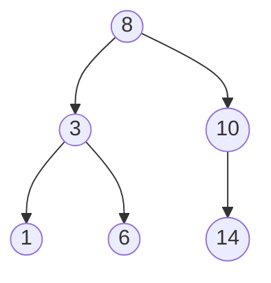
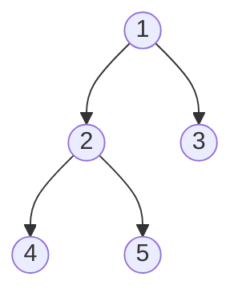
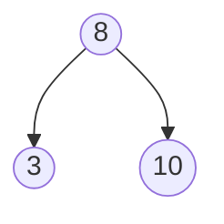
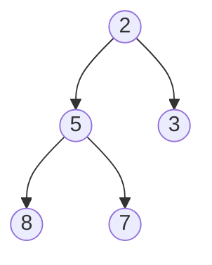

# 🌳 Trees — Concise Theory Guide

> [!NOTE]
> Pure concept notes — no code. Short, high-signal, built for fast recall. Trie is intentionally excluded (to be covered later).

## 📑 Contents
1. [[#01 - Introduction to Trees]]
2. [[#02 - Tree Terminology]]
3. [[#03 - Types of Trees]]
4. [[#04 - Binary Tree]]
5. [[#05 - Binary Search Tree]]
6. [[#06 - Tree Traversals (DFS & BFS)]]
7. [[#07 - Recursive vs Iterative Traversals]]
8. [[#08 - Binary Search Tree Operations]]
9. [[#09 - Heap as a Tree]]
10. [[#10 - Trees Interview Cheat Sheet]]

---

## 01 - Introduction to Trees

### What is a Tree?

A **Tree** is a **hierarchical, non-linear data structure** consisting of **nodes** connected by **edges** that represent **parent-child relationships**.

Trees model hierarchy natively, and — if balanced — give `O(log n)` search instead of `O(n)`.



> [!NOTE]
> **Core insight:** every subtree is itself a tree — this is *why* almost all tree logic is recursive.

### Properties

- `N` nodes → always `N - 1` edges
- Exactly one path from root to any node
- Acyclic and connected

### Real-world applications

- File systems (folders/files)
- DOM structure in browsers
- Decision-making systems

### Common mistakes

- Treating a tree like a general graph and assuming cycles are possible
- Assuming every tree is binary

**Next:** [[#02 - Tree Terminology]]

---

## 02 - Tree Terminology

Quick glossary — you'll use these constantly.

| Term | Meaning |
|---|---|
| Root | Top node, no parent |
| Parent / Child | Direct connection |
| Siblings | Share a parent |
| Leaf | No children |
| Edge | Parent↔child link |
| Ancestor / Descendant | Anywhere above / below on the path |
| **Depth** | Root **→** node (top-down) |
| **Height** | Node **→** deepest leaf (bottom-up) |
| Subtree | A node + all its descendants |
| Degree | Number of children a node has |

> [!WARNING]
> **Depth vs. Height** is the #1 confusion point and a favorite interview trap.
> - Root depth = 0
> - Leaf height = 0

### Real-world applications

- Depth → maps to file-path nesting depth
- Height → maps to org-chart "levels" counted from the bottom

### Common mistakes

- Swapping depth and height
- Forgetting a single-node tree has height 0, not 1
---
### Depth vs Height

### Depth
The **depth** of a node is the **number of edges from the root to that node**.

- Root --> Node
- Root depth = **0**
- Increases as we move downward

### Height
The **height** of a node is the **number of edges on the longest path from that node to a leaf**.

- Node --> Leaf
- Leaf height = **0**
- Root height = **Height of the tree**

---

### Example

```text
        A
      /   \
     B     C
    / \     \
   D   E     F
      /
     G
```

| Node | Depth | Height |
|------|:-----:|:------:|
| A | 0 | 3 |
| B | 1 | 2 |
| C | 1 | 1 |
| D | 2 | 0 |
| E | 2 | 1 |
| F | 2 | 0 |
| G | 3 | 0 |

### Quick Trick

- **Depth → Root → Node** (Top ⬇️ Down)
- **Height → Node → Leaf** (Bottom ⬆️ Up)

**Next:** [[#03 - Types of Trees]]

---

## 03 - Types of Trees



### By child count

| Type | Definition |
|---|---|
| Binary Tree | ≤ 2 children per node |
| N-ary Tree | Any number of children (file systems, DOM) |
| BST | Binary tree + left < node < right (ordering, not shape) |

### By shape (the "important three")

| Type | Definition |
|---|---|
| **Full** | Every node has **0 or 2** children — never exactly 1 |
| **Complete** | All levels fully filled **except possibly the last**, which fills **left to right** |
| **Perfect** | All internal nodes have 2 children **and** all leaves sit at the **same level** |
| Balanced | Left/right subtree heights differ minimally at every node → `O(log n)` ops |
| Heap | Complete tree + parent/child priority order |



> [!TIP]
> Every **Perfect** tree is also **Full** and **Complete** — but not the reverse.
>
> A **Complete** tree need not be **Full** (last level can have a single lonely child).
>
> Memorize each definition independently rather than assuming a hierarchy.

### Real-world applications

- Complete trees → heaps (schedulers, priority queues)
- Perfect trees → theoretical baseline for best-case complexity analysis
- Full trees → certain expression-tree representations

### Common mistakes

- Using "full," "complete," and "perfect" interchangeably
- Assuming "binary tree" automatically means "BST"
- Confusing "balanced" (a height-difference rule) with "complete" (a shape/filling rule)

**Next:** [[#04 - Binary Tree]]

---

## 04 - Binary Tree

### Intuition

Every node makes one binary choice — go left or right. That's the whole idea.



### Structure

Each node holds:
- A value
- A reference to a `left` child (or none)
- A reference to a `right` child (or none)

### How operations work conceptually

- **Height** of a node = 1 + the taller of its two subtrees' heights (empty tree = height -1)
- **Node count** = 1 (itself) + count of left subtree + count of right subtree
- Both are naturally recursive, since every subtree is itself a binary tree

### Complexity

| Operation | Time | Space |
|---|---|---|
| Traversal / height / count | `O(n)` | `O(h)` (call stack) |

- `O(log n)` height if balanced
- `O(n)` height if degenerate (skewed like a line)

### Real-world applications

- Expression trees (`(a+b)*c`)
- Foundational structure for BSTs and heaps

### Common mistakes

- Forgetting the empty/`null` base case
- Confusing a plain binary tree (no ordering) with a BST (ordered)

**Next:** [[#05 - Binary Search Tree]]

---

## 05 - Binary Search Tree

### Intuition

"Guess the number," baked into a tree — at every node you eliminate half the remaining search space.

### Rule

For every node:
`left subtree < node < right subtree`
— and this applies recursively, at every level.



### How search works conceptually

1. Compare target to current node
2. Equal → done
3. Smaller → go left
4. Larger → go right

Each comparison eliminates roughly half the remaining tree.

> [!NOTE]
> **Inorder traversal of a BST = sorted order.** Single most reusable BST fact in interviews.

### Complexity

- `O(log n)` if balanced
- `O(n)` if degenerate (e.g., inserting already-sorted data turns it into a linked list)

### Real-world applications

- In-memory sorted sets/maps
- Database indexing concepts
- Range queries on ordered data

### Common mistakes

- **"Validate BST" trap:** checking only immediate children instead of validating the entire subtree against a running `(min, max)` range
- Assuming a BST is automatically balanced

**Next:** [[#06 - Tree Traversals (DFS & BFS)]]

---

## 06 - Tree Traversals (DFS & BFS)

### Intuition

- **DFS** = go deep, backtrack later
- **BFS** = go wide, level by level (like ripples in water)



### The four traversals

| Traversal | Order (rule) | Use for |
|---|---|---|
| Preorder | Node → Left → Right | Cloning/serializing (root info needed first) |
| Inorder | Left → Node → Right | **Sorted output from a BST** |
| Postorder | Left → Right → Node | Deleting a tree / computing values that depend on children first |
| BFS (level-order) | Level by level | Shortest path, min depth, level-by-level processing |

### Complexity

| Traversal | Time | Space |
|---|---|---|
| DFS (any variant) | `O(n)` | `O(h)` — call stack |
| BFS | `O(n)` | `O(w)` — max tree width, up to `O(n)` |

### Real-world applications

- Postorder → safe bottom-up deletion, folder-size computation
- BFS → level-by-level UI rendering (e.g., nested comment threads), shortest-path-style problems

### Common mistakes

- Mixing up the three DFS orders under pressure — sketch the tree and write the order manually if unsure
- Forgetting the empty-tree check before starting BFS

**Next:** [[#07 - Recursive vs Iterative Traversals]]

---

## 07 - Recursive vs Iterative Traversals

### Idea

Recursion is an **implicit** call stack.

An iterative version makes that same stack **explicit** — giving the same result with more control, and no native stack-overflow risk on deep trees.

### Conceptual approach

**Preorder iteratively:**
1. Use a stack
2. Pop a node, visit it
3. Push its right child, then its left child (so left gets processed first, since a stack is LIFO)

**Inorder iteratively:**
1. Go as far left as possible, remembering nodes on a stack
2. Backtrack and process the most recent node
3. Move to its right subtree, then repeat

### Complexity

Identical to recursive — `O(n)` time, `O(h)` space.

> [!TIP]
> The benefit of going iterative is safety/control, not speed.

### Real-world applications

- Systems with strict stack-depth limits (embedded systems, some production runtimes) where recursion risks crashing on deep/unbalanced trees

### Common mistakes

- Pushing children in the wrong order in iterative preorder (reverses the intended sequence)
- Forgetting the iterative inorder loop must check **both** "current node exists" and "stack not empty"

**Next:** [[#08 - Binary Search Tree Operations]]

---

## 08 - Binary Search Tree Operations

### Insert / Search

Same "compare, then go left or right" logic as [[#05 - Binary Search Tree]].

Insertion just walks down until it finds an empty spot to place the new node.

### Delete — 3 cases

1. **Leaf** (no children) → simply detach it
2. **One child** → replace the node with that single child
3. **Two children** → replace the node's value with its **inorder successor** (the smallest value in its right subtree), then delete that successor from the right subtree



> [!TIP]
> You can use the inorder **predecessor** (largest in the left subtree) instead of the successor — either works. Pick one convention and stay consistent.

### Complexity

- `O(log n)` if balanced
- `O(n)` if degenerate

— for insert, search, and delete alike.

### Real-world applications

- Any system needing fast insert/search/delete while keeping data ordered (leaderboards, in-memory sorted indexes)

### Common mistakes

- Forgetting to correctly reattach a deleted node's remaining children in the two-children case
- Not handling "value not found" gracefully during delete

**Next:** [[#09 - Heap as a Tree]]

---

## 09 - Heap as a Tree

### Intuition

A strict "chain of command":
- A parent always has higher priority than its children
- Siblings have no required relationship to each other (looser than a BST's ordering)

### Rule

**Min-Heap:** parent ≤ both children, recursively. Root is always the smallest value.
**Max-Heap:** the mirror image — root is always the largest value.



> [!NOTE]
> A heap is always a **complete** binary tree, which is why it's conventionally implemented using an **array** rather than linked nodes.
>
> Array index math maps perfectly onto a complete tree's shape:
> - Left child → `2i + 1`
> - Right child → `2i + 2`
> - Parent → `Math.floor((i - 1) / 2)`

### How operations work conceptually

**Insert:**
1. Add at the next open array slot
2. "Bubble up" — swap with parent while the heap rule is violated

**Extract min/max:**
1. Remove the root
2. Move the last element into its place
3. "Bubble down" — swap with the smaller (or larger) child while the rule is violated

### Complexity

| Operation | Time |
|---|---|
| Insert | `O(log n)` |
| Extract min/max | `O(log n)` |
| Peek (top priority) | `O(1)` |

### Real-world applications

- Priority queues
- Task scheduling
- Dijkstra's shortest-path algorithm
- "Top K" problems

### Common mistakes

- Treating a heap like a BST (no arbitrary-value search guarantee)
- Forgetting to move the last element into the root position before bubbling down during extraction

**Next:** [[#10 - Trees Interview Cheat Sheet]]

---

## 10 - Trees Interview Cheat Sheet

### Pattern Recognition

| Problem mentions... | Think... |
|---|---|
| sorted order, kth smallest in BST | Inorder traversal |
| clone, serialize | Preorder traversal |
| delete tree, compute from children up | Postorder traversal |
| shortest path, min depth, level-by-level | BFS |
| validate BST | Range-check (min/max bounds), not local comparison |
| kth largest, top K, scheduling, priority | Heap |
| "avoid recursion?" | Iterative traversal, explicit stack/queue |

### Complexity at a Glance

| Structure/Op | Balanced | Worst case |
|---|---|---|
| BST search/insert/delete | `O(log n)` | `O(n)` |
| Any traversal | `O(n)` | `O(n)` |
| Heap insert/extract | `O(log n)` | `O(log n)` |
| Heap peek | `O(1)` | `O(1)` |

### Full / Complete / Perfect — Quick Recall

- **Full** → 0 or 2 children, never 1
- **Complete** → filled left-to-right, level by level
- **Perfect** → Full **and** all leaves at the same level

### Top Pitfalls (Across All Topics)

- Depth (top-down) vs. Height (bottom-up) — don't swap them
- Binary tree ≠ BST ≠ balanced — three separate guarantees
- BST validation needs full-subtree range checks, not just immediate children
- Heaps aren't searchable like BSTs
- Full / Complete / Perfect are distinct shape rules — don't use interchangeably

### Before You Code (say this out loud)

1. What kind of tree is this — binary, BST, n-ary, heap?
2. Which traversal fits, and why?
3. What's the base case?
4. Time/space complexity — balanced vs. worst case?
5. Edge cases — empty tree, single node, duplicates, degenerate shape?

---

> [!NOTE]
> Theory complete (01–10). Trie will be covered separately later. Problem-specific techniques (height, diameter, LCA, views, serialization, etc.) go in `DSA/Trees/Problems/` when requested.
